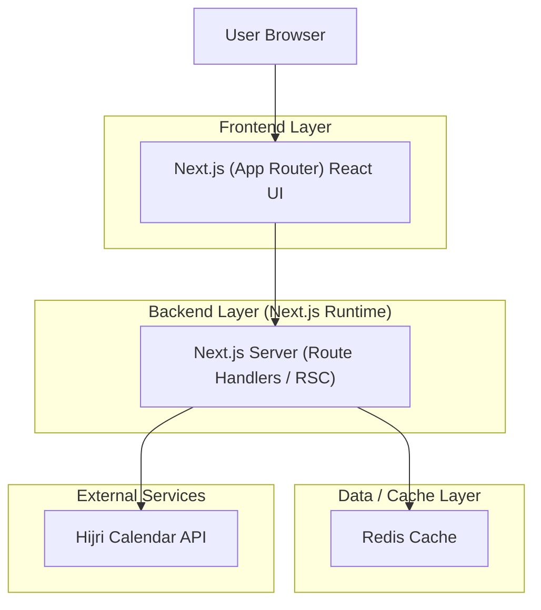

## 1.Architecture design


## 2.Technology Description
- Frontend: Next.js (App Router) + React@18 + TypeScript + CSS Modules or tailwindcss
- Backend: Next.js Route Handlers (server-side fetching + caching orchestration)
- Cache: Redis (Hijri 24h caching + search results caching)
- Animation: Web Animations API and/or CSS keyframes (prefer CSS-first), optional requestAnimationFrame for minimal effects

## 3.Route definitions
| Route | Purpose |
|-------|---------|
| / | Home page: seasonal animated background + Hijri-aware theming + Trending Now module |
| /discover | Discover page: query-driven results UI (URL-synced), uses cached search responses |
| /discover/[slug] | SEO detail page: pre-rendered page for a slug with metadata and content layout |
| /api/hijri | Server endpoint that fetches Hijri API and caches for 24h |
| /api/search | Server endpoint for search/trending; caches normalized query results |

## 4.API definitions (If it includes backend services)
### 4.1 Shared TypeScript types
```ts
export type HijriContext = {
  gregorianDateISO: string; // e.g. "2026-02-22"
  hijriDateText: string;    // display-ready, source-dependent
  hijriDay: number;
  hijriMonth: number;
  hijriYear: number;
  timezone: string;
  fetchedAtISO: string;
};

export type DiscoverItem = {
  slug: string;
  title: string;
  description?: string;
  imageUrl?: string;
  updatedAtISO?: string;
};

export type SearchRequest = {
  q: string;
  limit?: number;
  offset?: number;
};

export type SearchResponse = {
  q: string;
  items: DiscoverItem[];
  total?: number;
  cached: boolean;
};
```

### 4.2 Core API (Route Handlers)
`GET /api/hijri?date=YYYY-MM-DD&tz=Area/City`
- Behavior: read-through cache in Redis; TTL = 86400 seconds; returns cached if present.

`GET /api/search?q=...&limit=...&offset=...`
- Behavior: cache by normalized query params; TTL based on product needs (e.g., minutes to hours); returns cached results when present.

## 6.Data model(if applicable)
### 6.1 Redis key schema (logical)
- Hijri context: `hijri:{tz}:{gregorianDateISO}` → `HijriContext` (TTL 24h)
- Search results: `search:{hashOfNormalizedParams}` → `SearchResponse` (TTL configurable)
- Trending now: `trending:{scope}` → `DiscoverItem[]`